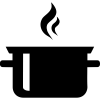

<p align="center">

</p>

<h1 align="center"> conviva-soup</h1>

A Scala library to estimate totals, means, and ratios from simple random sample or stratified random sample designs. A short demo of soup's functionality is shown below, consult the wiki pages for more details.

### Simple random sample designs

For simple random sample (SRS) designs, use the `SRS` class, which requires a `DataFrame` and `Column` representing the population size. 

```scala 
val srs = SRS(agdat, popSize = col("N"))
```

To estimate the mean, use the `svymean` method:

```scala mdoc
val ac92mean = srs.svymean(y = col("acres92"))
```

The `svymean` method works for proportions:

```scala mdoc
val ac92prop = srs.svymean(y = col("lt200k"))
```

To estimate the total use  the `svytotal` method:
```scala mdoc
val ac92tot = srs.svytotal(y = col("acres92"))
```

To estimate a ratio, use the `svyratio` method:

```scala mdoc 
val acrat = srs.svyratio(num = col("acres92"), den = col("acres87"))
```

Soup can also obtain estimates for a group or strata using the `strata`
parameter:

```scala mdoc
val tsrs = SRS(agstrat, popSize = col("N"), strata = col("region"))
tsrs.svymean(col("acres92"))
tsrs.svytotal(col("acres92"))
```

Please see the https://github.com/Conviva-Internal/soup/wiki/1-Simple-random-sample page for more info. 


### Stratified sampling designs

For a stratified sampling design, use the `STRS` class, which requires a `DataFrame`, a `Column` for the sampling weights, and a `Column` for the strata. As before, the estimated  means and totals by group are obtained using the `svymean` and `svytotal` methods:

```scala mdoc
val dstr = STRS(strdat, popSize = col("N"), strata = col("region"))
val ac92mean = dstr.svymean(col("acres92"))
val ac92tot = dstr.svytotal(col("acres92"))
```

Please see the https://github.com/Conviva-Internal/soup/wiki/2-Stratified-random-sample page for more info. 

 
"For large populations it is the size of the sample taken, not the percentage of the population sampled, that determines the precision of the estimator: If your soup is well stirred, you need to taste only one or two spoonfuls to check the seasoning, whether you have made 1 liter or 20 liters of soup." Sharon Lohr - Sampling Design and Analysis (2022).
